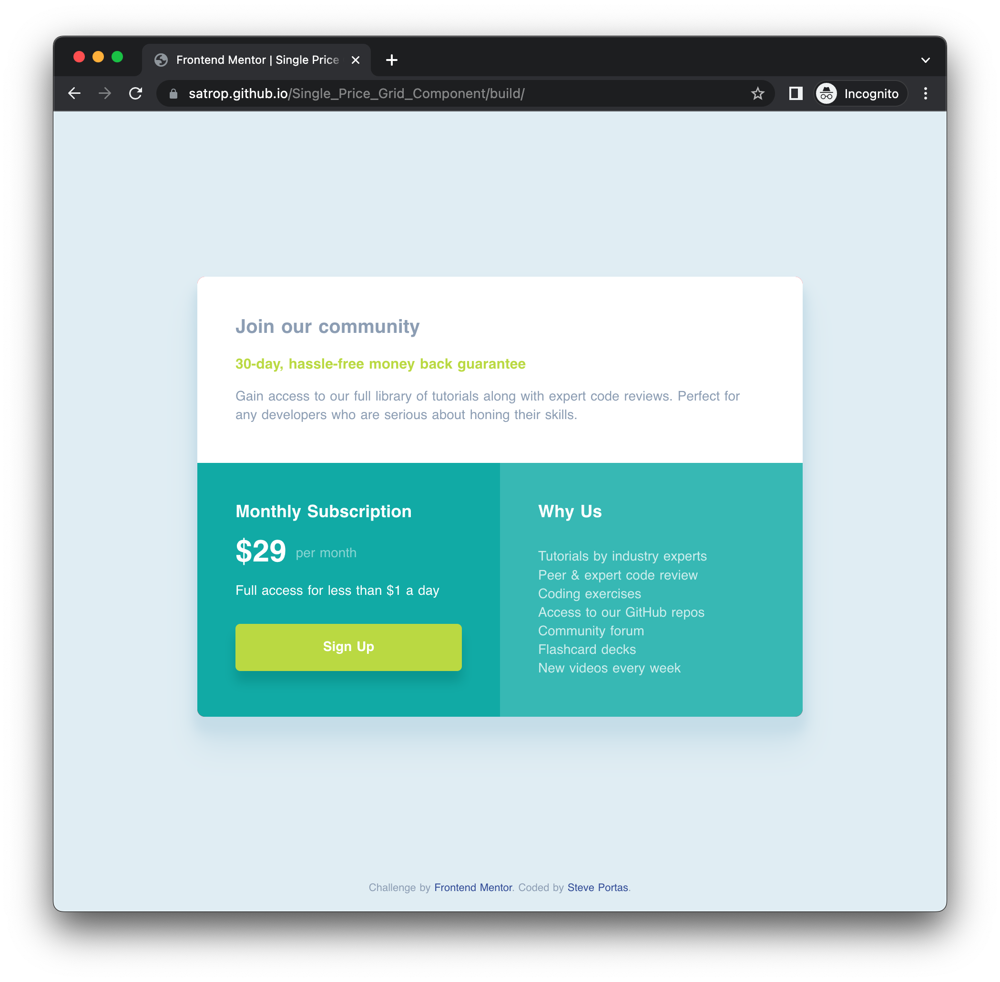

# [Frontend Mentor - Single price grid component solution](https://satrop.github.io/Single_Price_Grid_Component/build/)

This is a solution to the [Single price grid component challenge on Frontend Mentor](https://www.frontendmentor.io/challenges/single-price-grid-component-5ce41129d0ff452fec5abbbc). Frontend Mentor challenges help you improve your coding skills by building realistic projects. 

## Overview

### The challenge

Users should be able to:

- View the optimal layout for the component depending on their device's screen size
- See a hover state on desktop for the Sign Up call-to-action

### Screenshot



### Links

- [Solution URL](https://github.com/satrop/Single_Price_Grid_Component)
- [Live Site URL](https://satrop.github.io/Single_Price_Grid_Component/build/)

## My process

### Built with

- Semantic HTML5 markup
- CSS custom properties
- Flexbox
- CSS Grid
- Mobile-first workflow

### What I learned

Not to much to talk about on this. Did mini project to remind myself how to use the Grid as I don't get to us it much/at all in my daily work. I was keep to practice the placement of columns using the `grid-column`. 

```scss
.card {

  ...

  &__block {
    padding: u.rem(23) u.rem(24);

    &:nth-child(1) {
      background-color: var(--clr-n-300);
      border-radius: u.rem(8) u.rem(8) 0 0;
    }

    &:nth-child(2) {
      background-color: var(--clr-p-100);
      color: var(--clr-n-300);
    }

    &:nth-child(3) {
      background-color: var(--clr-p-300);
      color: var(--clr-n-300);
      border-radius: 0 0 u.rem(8) u.rem(8);
    }
  }

  @include u.breakpoint(md) {
    grid-template-columns: repeat(2, 1fr);
    grid-template-rows: repeat(2, auto);
    width: min(80%, 635px);

    &__block {
      padding: u.rem(40);

      &:nth-child(1) {
        grid-column: 1 / 3;
      }

      &:nth-child(2) {
        grid-column: 1 / 2;
        border-radius: 0 0 0 u.rem(8);
      }

      &:nth-child(3) {
        grid-column: 2 / 3;
        border-radius: 0 0 u.rem(8) 0;
      }
    }
  }
}
```
